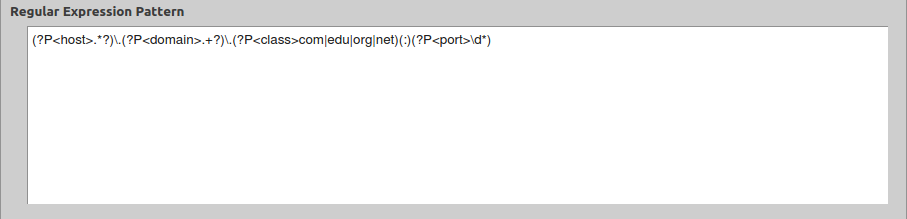
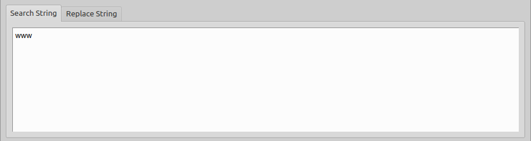
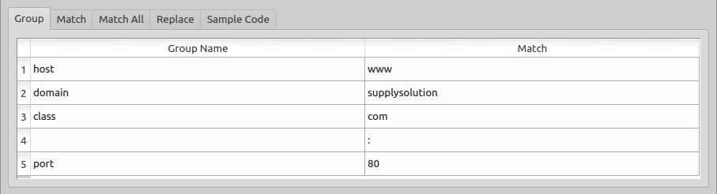
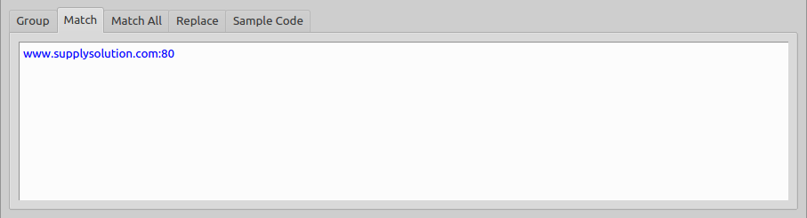

An Example
==========

In this example we will create a trivial domain name parser. This is not intended to be the best example of using Kang, rather, it will focus on using as many features as possible.

First, let us enter our regular expression. This regular expression will use group names to capture the **host**, **domain** and the domain **class** as well as the **port** number. Additionally, an unnamed group will be captured which seperates the class from the port (for the sole purpose of demonstration).

We write the following regualar expression into the 'Regular expression entry'::

 (?P<host>.*?)\.(?P<domain>.+?)\.(?P<class>com|edu|org|net)(:)(?P<port>\d*)

          
In this case, we would like the make this case-insensitive, so we select the appropriate flags checkbox

     
We will then enter a partial string.

We can see from the status bar that this string does not match our regular expression

.. figure:: _images/example-status-nomatch.png
     :alt: Fig. Pattern does not match or there is a syntax error

Finally, we enter our string in it's entirety.  

.. figure:: _images/example-searchstring2.png
     :alt: Fig. Our final string

Upon doing so, our status will indicate success

and our groups will appear in the "groups" list.

If we used this regular expression in a python application, we could retrieve the group data as such:

=============== ================== ==============
by group number by group name      match
=============== ================== ==============
re.group(1)     re.group('host')   www
re.group(2)     re.group('domain') supplysolution
re.group(3)     re.group('class')  com
re.group(4)     Not applicable     :
re.group(5)     re.group('port')   80
=============== ================== ==============

The matching string can be seen by viewing the "match" output tab

