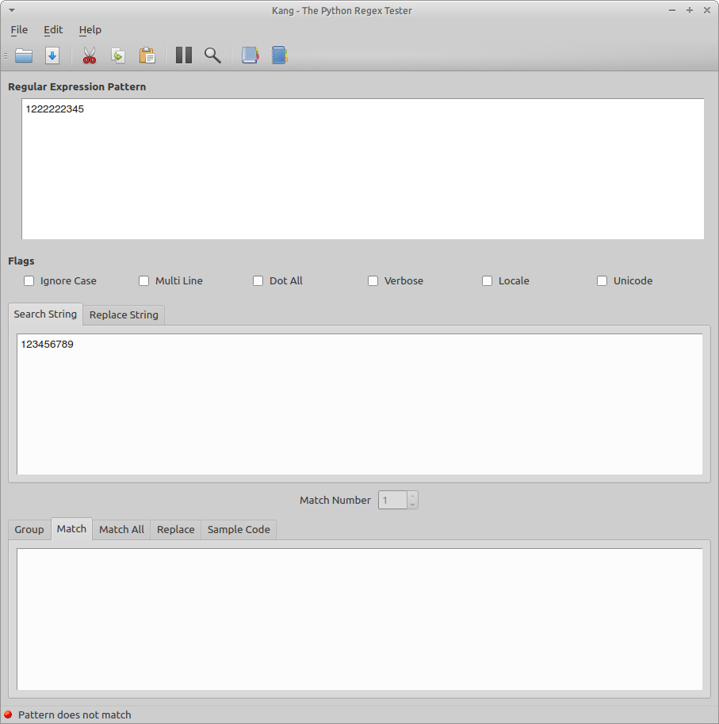
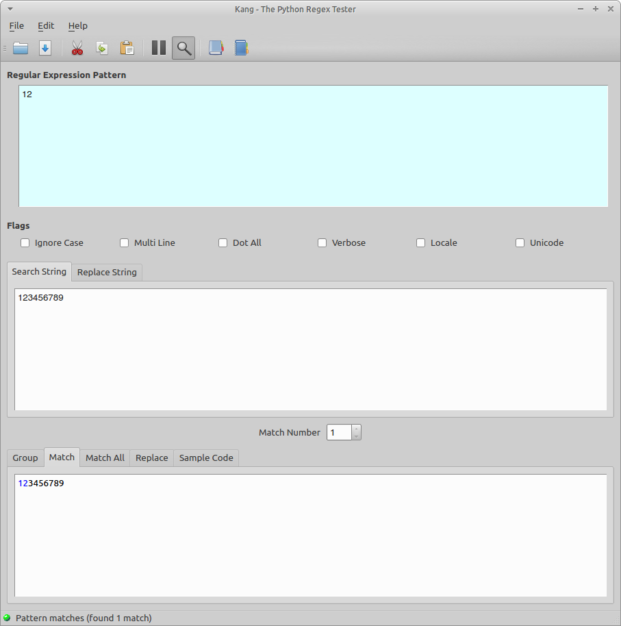

Examining a regular expression
==============================

The examine feature is useful in the event when a regex that you have been editing no longer matches the text string.
In some instances you may have inadvertantly added a character. 
Normally, the only indication that you have that the regex doesn't match is the status bar indicator. 
Although this alone may be useful, Kodos provides the examine to help pinpoint errors. 

By examining the regex, Kang will locate the longest possible match by eliminating scanning the current regex. 
Consider the following example: 

By pressing the examine toolbar button, Kodos will find the last possible match and enter examination mode.
The examination mode is indicated by changing the background of the regex edit dialog yellow.
While in examination mode you are prevented from editing the regex (i.e. this is a read-only mode)

Press the examine button To exit examination mode.
Upon exiting examination mode the background color will return to it's original color and the regex that you were editing will be restored. 
