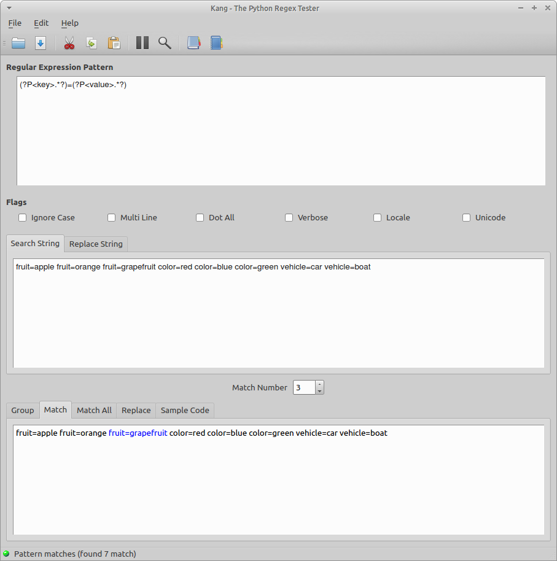

The Main Window
===============

The Kang main window is divided into several components: Regular Expression, Flags, String and the Output Tab

The regular expression entry box allows you to enter and edit a regular expression.

You can set the python regular expressions flags by selecting from the "flags" chceckboxes

The string entry dialog allows you to test your regular expression against a string.

If your regular expression contains groupings then a list of the groups and string matches are displayed. 
If the groups are named (ie. (?P) ) then the group name will also appear.

The Match output tab displays the regex match context in relation to the input string

If the regex matches the input string more than once, then the "Match Number" spinbox is enabled and allows you to scroll through the range of matched items. As you scroll through the matches, the Match output tab and the Group output tab will be updated to reflect the match number.

Depending on the state of your regular expression and string you will see one of the following displayed on the status bar:

*Waiting for user input*

*Pattern does not match or there is a syntax error*

*The pattern matches the string*

The complete window looks like:

