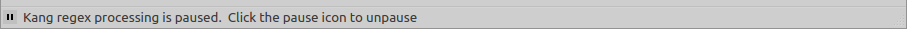

Pausing processing of a regex
=============================

The pause button is a toggle button that allows you to suspend the processing of a regular expression. This is useful in cases where the regex seems to take a long time to be processed.

If Kang is paused the regex will no longer be processed in real-time.

A pause state is indicated by the toggled toolbar icon

and a status message.

To unpause Kang, simple select the pause button again. This will cause Kang to process the regex immediately.
