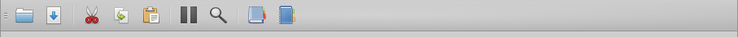

The Toolbar
===========

The Kang toolbar provides quick access to frequently used functionality.

From left-to-right:

#. Load file
#. Save file
#. Cut
#. Copy
#. Paste
#. :doc:`Pause <pause>`
#. :doc:`Examine <examine>`
#. Regular Expression Reference Guide
#. Regular Expression Library
